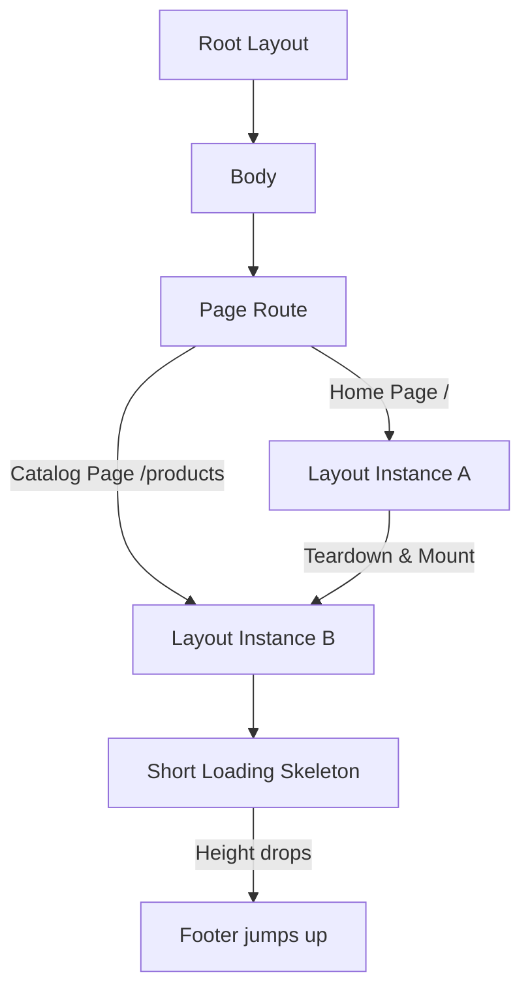
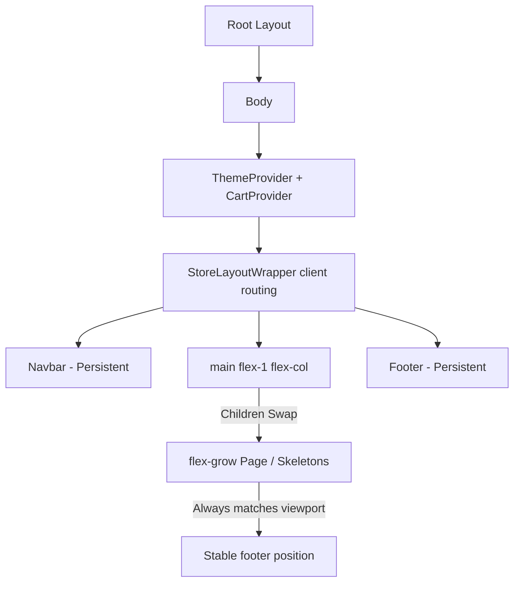

# Next.js Smooth Navigation & Layout Stability Report

This document details the modifications made to the Next.js App Router setup to eliminate page-load flashes, vertical layout collapse (footer jumping), horizontal shifting (scrollbar toggle jumps), and double-rendering hydration states.

---

## 1. Summary of Diagnosed Issues & Solutions

| Issue | Root Cause | Technical Solution |
| :--- | :--- | :--- |
| **Footer Jumping Up/Down** | Active content wrappers lacked height classes. Skeletons were shorter than the viewport, causing page collapse on unmount. | Switched layout parent to `flex-1` and added `flex-grow flex-col w-full` to all page pages and skeleton loading views. |
| **Horizontal Content Shifting** | Scrollbars toggled on and off between long pages (with scrollbar) and short loading skeletons (no scrollbar). | Set `html { scrollbar-gutter: stable; }` inside `globals.css` to reserve scrollbar viewport margins. |
| **Double Skeleton Flash** | Conflicting Nested Suspense: outer layout segment loading (`loading.tsx`) and inner query Suspense wrapper (`ProductsPageSkeleton`). | Synced the Catalog page Suspense to share the exact same fallback components (`ProductsLoading`) to prevent React DOM rebuilding. |
| **Hydration Loader Collapse** | Simulating client cart loading (`isLoaded = false`) rendered a tiny `py-12` spinner block that collapsed checkout page height. | Configured checkout loading logic to render the full `CheckoutLoading` skeleton during hydration, making the mount seamless. |
| **Flashed/Unmounted Layout** | Root page was outside the route group segment layout, triggering full teardown/recreation of navigation headers. | Restructured wrapping into a global conditional client checker (`StoreLayoutWrapper.tsx`) nested directly inside root `layout.tsx`. |

---

## 2. File-by-File Changes Detail

### 1. Global Spacing & Layout Structure
* **[globals.css](file:///d:/COURSES/Web%20Development/Projects%20Lists/Backend/buildcart/src/app/globals.css#L92)**:
  Added `html { scrollbar-gutter: stable; }` to maintain scrollbar slots across all route pages.
* **[StoreLayoutWrapper.tsx](file:///d:/COURSES/Web%20Development/Projects%20Lists/Backend/buildcart/src/components/store/StoreLayoutWrapper.tsx)**:
  Created a global wrapper that selectively hooks up storefront parts (Navbar, Footer, CartDrawer) based on the pathname (skipping `/admin`), and coordinates height with the body via `flex flex-col flex-1 w-full`.
* **[layout.tsx](file:///d:/COURSES/Web%20Development/Projects%20Lists/Backend/buildcart/src/app/layout.tsx)**:
  Moved the layout wrapper to the root so headers, footers, and cart states stay persistently mounted.

### 2. Active Page Content Height Matching
Modified the root container of each page to utilize `flex-grow flex flex-col w-full` to claim all vertical height:
* **[page.tsx (Homepage)](file:///d:/COURSES/Web%20Development/Projects%20Lists/Backend/buildcart/src/app/page.tsx)** (Also converted to Server Component for static pre-rendering, resolving client shift).
* **[products/page.tsx (Catalog)](file:///d:/COURSES/Web%20Development/Projects%20Lists/Backend/buildcart/src/app/(store)/products/page.tsx)** (Also synchronized Suspense to use `ProductsLoading`).
* **[products/[slug]/page.tsx (Details)](file:///d:/COURSES/Web%20Development/Projects%20Lists/Backend/buildcart/src/app/(store)/products/[slug]/page.tsx)**
* **[checkout/page.tsx (Checkout)](file:///d:/COURSES/Web%20Development/Projects%20Lists/Backend/buildcart/src/app/(store)/checkout/page.tsx)** (Also swapped hydration loading state to render `CheckoutLoading` skeleton).

### 3. Route-Level Loading Skeletons Height Matching
Applied `flex-grow flex flex-col w-full` to matching loading views, preventing height drop during skeleton loads:
* **[loading.tsx (Home Skeleton)](file:///d:/COURSES/Web%20Development/Projects%20Lists/Backend/buildcart/src/app/loading.tsx)**
* **[products/loading.tsx (Catalog Skeleton)](file:///d:/COURSES/Web%20Development/Projects%20Lists/Backend/buildcart/src/app/(store)/products/loading.tsx)**
* **[products/[slug]/loading.tsx (Details Skeleton)](file:///d:/COURSES/Web%20Development/Projects%20Lists/Backend/buildcart/src/app/(store)/products/[slug]/loading.tsx)**
* **[checkout/loading.tsx (Checkout Skeleton)](file:///d:/COURSES/Web%20Development/Projects%20Lists/Backend/buildcart/src/app/(store)/checkout/loading.tsx)**

### 4. Layout CLS Image Stability
Enabled optimized image rendering by configuring host verification remote patterns inside `next.config.ts` and swapped all custom `` tags for Next.js `<Image>` tags inside aspect-ratio containers, maintaining structural stability:
* **Homepage Banner**: Upgraded to optimized `<Image>` with priority tags.
* **[ProductCard.tsx](file:///d:/COURSES/Web%20Development/Projects%20Lists/Backend/buildcart/src/components/store/ProductCard.tsx)**: Replaced card thumbnails with responsive-sized `<Image>` components.
* **Product Details Showcase**: Replaced active gallery swaps and thumbnail arrays.
* **Cart Drawer & Checkout Listings**: Formatted relative container slots with sizes.

---

## 3. Structural Comparison

The structural differences between the previous structure and the corrected layout are shown below:

### Previous Structure (Layout tearing & height collapses)

### Corrected Stable Structure (Persistent Header/Footer & Flexible Skeletons)

